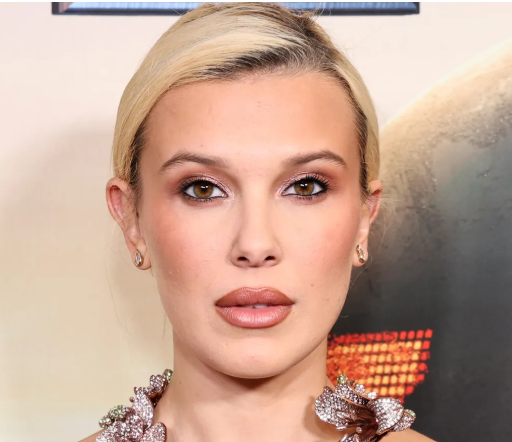
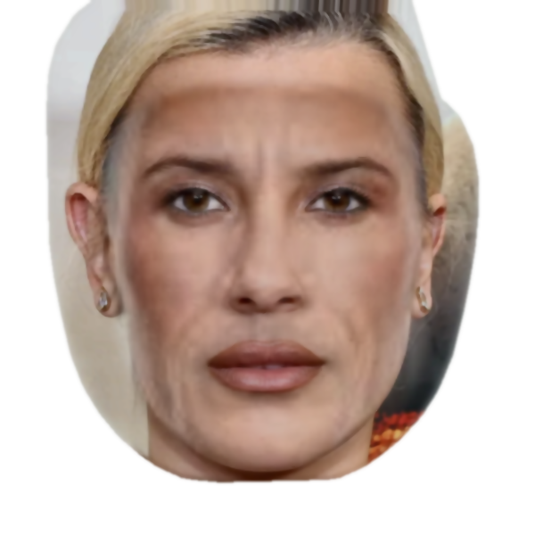

# FaceBlend

A Python face morphing tool that creates seamless face composites by blending facial features from two images. Uses MediaPipe for 468-point facial landmark detection and OpenCV for image processing.

## Example

| Image 1 | Image 2 | Result |
|:-------:|:-------:|:------:|
|  |  |  |

## Features

- Automatic face detection and alignment
- Skin tone matching between faces
- Delaunay triangulation for smooth morphing
- EXIF orientation correction
- Batch processing support
- Configurable blend ratios

## Installation

```bash
git clone https://github.com/yourusername/HKSAFaceBlend.git
cd HKSAFaceBlend
pip install -r requirements.txt
```

## Quick Start

### Single Pair

```bash
python face_blender.py person1.png person2.png -o result.jpg
```

### Batch Processing

1. Add face images (PNG/JPG) to the `Faces/` directory
2. Edit `Faces.txt` with pairs to blend:
   ```
   Alice, Bob
   Person1, Person2
   ```
3. Run:
   ```bash
   python batch_blend.py
   ```

Results are saved to `Results/`.

## CLI Options

| Option | Description | Default |
|--------|-------------|---------|
| `-o`, `--output` | Output filename | `blended_result.jpg` |
| `-s`, `--size` | Output size in pixels | `600` |
| `-b`, `--blend` | Blend ratio (0.0-1.0) | `0.5` |

### Blend Ratio

- `0.0` = Features mostly from image 1
- `0.5` = Equal blend from both images
- `1.0` = Features mostly from image 2

## Project Structure

```
HKSAFaceBlend/
├── face_blender.py   # Core morphing engine
├── batch_blend.py    # Batch processing script
├── requirements.txt  # Python dependencies
├── Faces.txt         # Face pairs configuration
├── Faces/            # Input images (PNG/JPG)
└── Results/          # Output images
```

## Requirements

- Python 3.8+
- Frontal or near-frontal face photos
- Clear, well-lit images

## How It Works

1. Detects 468 facial landmarks using MediaPipe
2. Normalizes face orientation and skin tones
3. Creates Delaunay triangulation mesh
4. Warps triangles using affine transforms
5. Blends features with multi-tier masking
6. Composites hair from image 1 onto final result

## Limitations

- Requires clearly visible, roughly frontal faces
- Extreme profile angles may fail detection
- Hair is always taken from the first image

## License

MIT License - see [LICENSE](LICENSE) for details.
